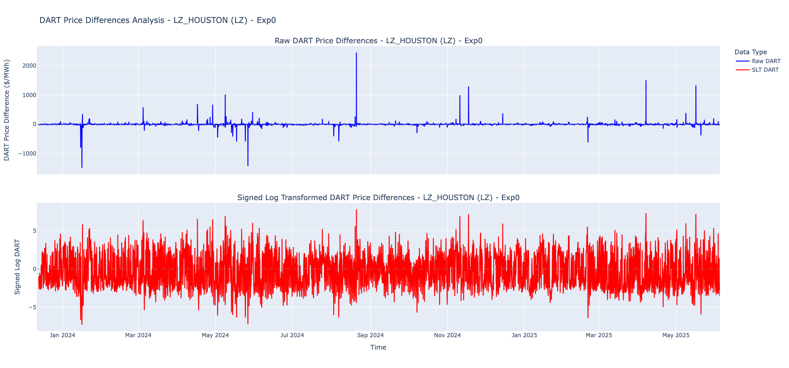
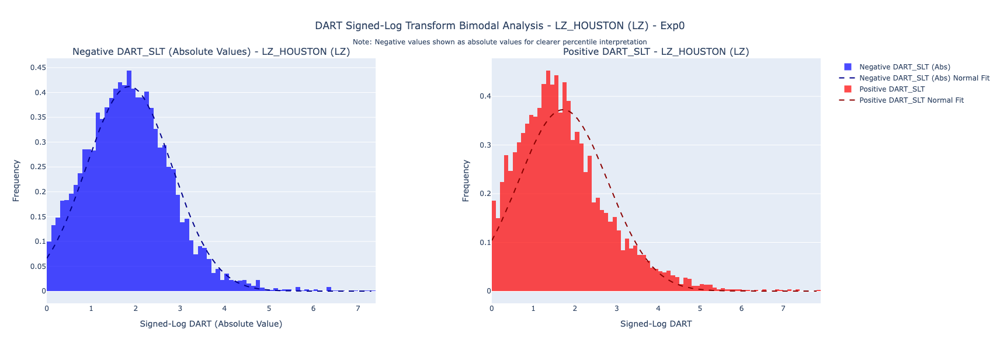
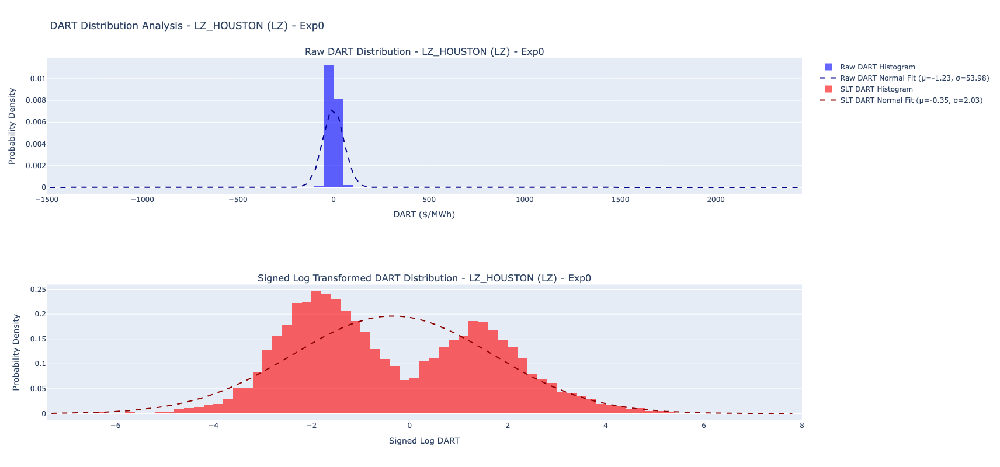
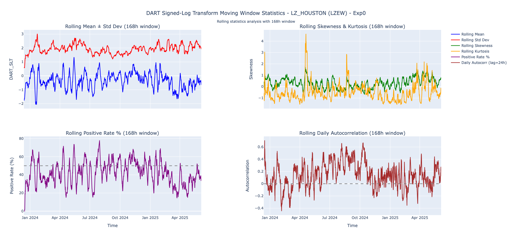
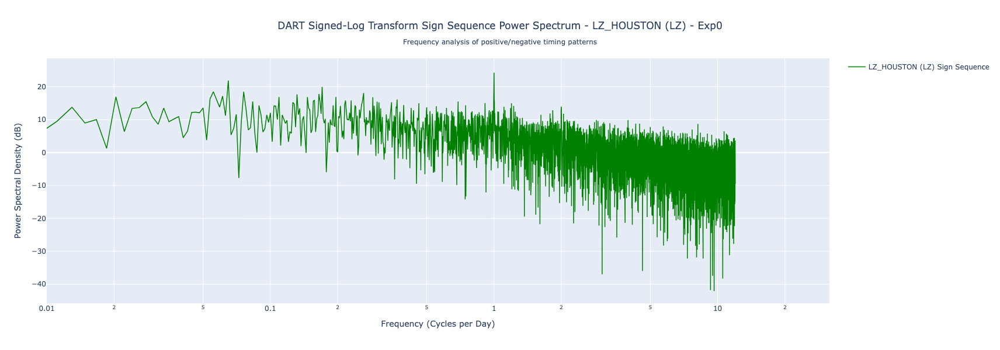
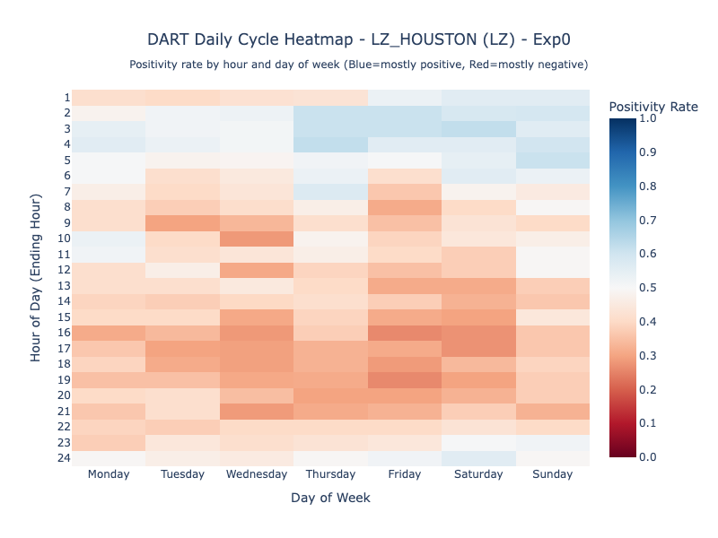
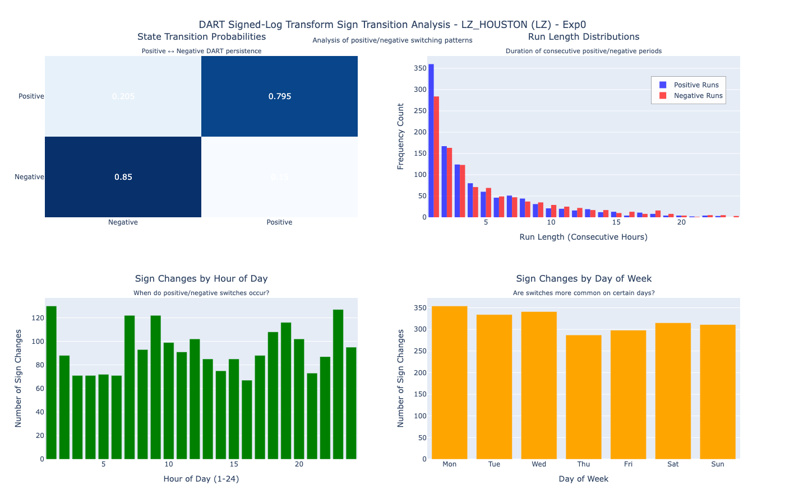

ercot_dart
==============================

# First Look: ERCOT Real-Time vs DAM Settlement Point Prices Using LZ (Houston) as an Example

This initial analysis explores the hourly differences between ERCOT real-time market (RTM) and day-ahead market (DAM) settlement prices — commonly referred to as **DART** (RTM minus DAM). We use **LZ_HOUSTON** as a representative settlement point. The focus is exploratory: understanding DART's statistical behavior, periodic structure, and temporal dynamics.  The dataset spans January 1, 2024 through June 5, 2025.  The data was downloaded from ERCOT using the Public API.

---

## Temporal Dynamics

Both raw and Signed Log Transform (SLT) DART series show frequent, high-amplitude spikes:
- Many large events persist for only 1–3 hours
- These transient but extreme excursions have significant economic impact
- SLT representation captures structure while reducing sensitivity to scale

---

## Distributional Behavior

The signed-log transform of DART (SLT) reveals a bimodal structure:
- Both positive and negative regimes exhibit long right tails
- Peak densities occur at moderate values (1–2 on the log scale), with sharp fall-off for extreme deviations
- The tails are heavy and non-Gaussian, highlighting risk of large deviations

---

The raw DART distribution is sharply peaked near zero with extreme outliers in both directions. The signed-log transform:
- Symmetrizes the distribution
- Makes the tails more interpretable
- Enables side-by-side analysis of positive and negative deviations

---

Rolling 168-hour windows reveal:
- Oscillating volatility and skewness over time
- Persistent deviations from symmetry and normality
- Periods of increased kurtosis, indicating bursts of extreme events
- Positive rate fluctuates over time, rarely holding near 50%

---

## Cyclic and Spectral Patterns

Spectral analysis of the DART **sign sequence** shows a clear peak near **1 cycle/day**, indicating:
- A non-random alternation between positive and negative DARTs
- Evidence of calendar-driven structure (e.g., diurnal ramp patterns)

---

Hourly positivity rates across days of the week reveal:
- Consistently **negative DARTs** during business hours (8:00–22:00)
- More **positive DARTs** observed during overnight and early morning hours
- Weekends display more mixed or neutral behavior

---

## Sign Transitions

State transition and run-length analysis of DART sign behavior indicates:
- Strong persistence: ~80% chance that a positive or negative run continues hour-to-hour
- Most runs are short (1–3 hours), but extended regimes do occur
- Transitions cluster at specific hours (1AM, 9AM, 11PM), likely aligned with market and load cycles

---

These findings set the stage for more advanced modeling, forecasting, and integration into bidding and hedging strategies in the ERCOT day-ahead market.

==============================

I use CookieCutter as a starting point.

Project Organization
------------

    ├── LICENSE
    ├── Makefile           <- Makefile with commands like `make data` or `make train`
    ├── README.md          <- The top-level README for developers using this project.
    ├── data
    │   ├── external       <- Data from third party sources.
    │   ├── interim        <- Intermediate data that has been transformed.
    │   ├── processed      <- The final, canonical data sets for modeling.
    │   └── raw            <- The original, immutable data dump.
    │
    ├── docs               <- A default Sphinx project; see sphinx-doc.org for details
    │
    ├── models             <- Trained and serialized models, model predictions, or model summaries
    │
    ├── notebooks          <- Jupyter notebooks. Naming convention is a number (for ordering),
    │                         the creator's initials, and a short `-` delimited description, e.g.
    │                         `1.0-jqp-initial-data-exploration`.
    │
    ├── references         <- Data dictionaries, manuals, and all other explanatory materials.
    │
    ├── reports            <- Generated analysis as HTML, PDF, LaTeX, etc.
    │   └── figures        <- Generated graphics and figures to be used in reporting
    │
    ├── requirements.txt   <- The requirements file for reproducing the analysis environment, e.g.
    │                         generated with `pip freeze > requirements.txt`
    │
    ├── setup.py           <- makes project pip installable (pip install -e .) so src can be imported
    ├── src                <- Source code for use in this project.
    │   ├── __init__.py    <- Makes src a Python module
    │   │
    │   ├── data           <- Scripts to download or generate data
    │   │   └── make_dataset.py
    │   │
    │   ├── features       <- Scripts to turn raw data into features for modeling
    │   │   └── build_features.py
    │   │
    │   ├── models         <- Scripts to train models and then use trained models to make
    │   │   │                 predictions
    │   │   ├── predict_model.py
    │   │   └── train_model.py
    │   │
    │   └── visualization  <- Scripts to create exploratory and results oriented visualizations
    │       └── visualize.py
    │
    └── tox.ini            <- tox file with settings for running tox; see tox.readthedocs.io

--------

<small>Project based on the <a target="_blank" href="https://drivendata.github.io/cookiecutter-data-science/">cookiecutter data science project template</a>. #cookiecutterdatascience</small>

