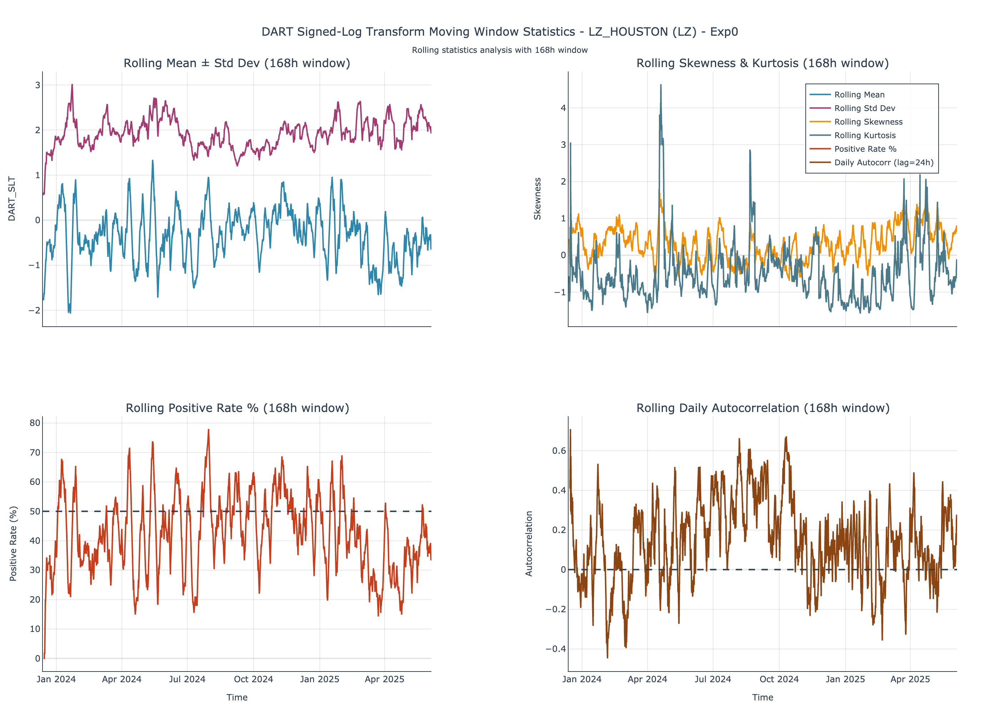
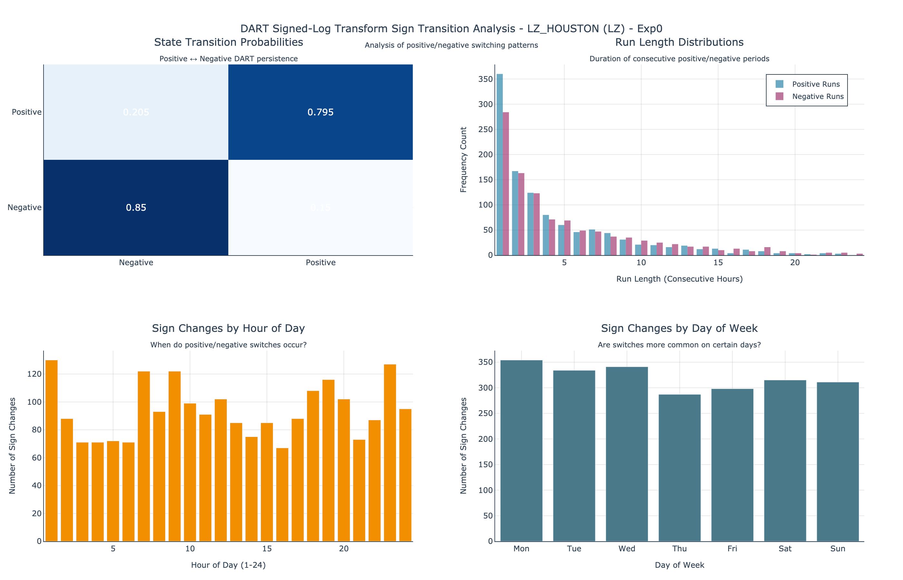

# ercot_dart

## First Look: ERCOT Real-Time vs DAM Settlement Point Prices Using LZ (Houston) as an Example

This initial analysis explores the hourly differences between ERCOT real-time market (RTM) and day-ahead market (DAM) settlement prices — commonly referred to as **DART** (RTM minus DAM). We use **LZ_HOUSTON** as a representative settlement point. The focus is exploratory: understanding DART's statistical behavior, periodic structure, and temporal dynamics.

The dataset spans **January 1, 2024 through June 5, 2025**, and the data products needed to support these computations were downloaded via the [ERCOT Public API](https://www.ercot.com/mp/data-products).

Note, the figures below are .png.  Each figure is also available by request as a plotly html for interactive exploration.

---

## Temporal Dynamics

The raw and transformed DART series show:
- Frequent, high-amplitude price excursions
- Short-lived spikes (typically 1–3 hours)
- The **Signed Log Transform (SLT)** retains directional information while compressing extreme values:

  `SLT(x) = sign(x) * log(1 + abs(x))`

This helps reveal structure while preserving magnitude asymmetry.

---

## Distributional Behavior

- The raw DART distribution is sharply peaked near zero with long tails.
- SLT symmetrizes and normalizes magnitude for clearer tail inspection and segmentation.

---

Separate histograms of positive and negative SLT values (shown as absolute):
- Reveal clear right-skew in both distributions
- Indicate heavy-tailed, non-Gaussian behavior
- Suggest different dynamics for positive vs negative deviations

---

## K-Means Cluster Analysis

To identify natural regime groupings:

Using K-means clustering on **positive and negative SLT magnitudes separately**:
- Optimal segmentation is **three clusters** on each side
- These correspond to mild, moderate, and severe pricing deviations

---

When clustering the **signed SLT values together**:
- Optimal **two-cluster solution** aligns with DART polarity (positive vs negative)
- Suggests sign alone captures the dominant regime division

---

## Moving Window Behavior

Using a 168-hour rolling window:
- Standard deviation, skewness, and kurtosis vary significantly over time
- Indicates changing volatility and shape
- Positive rate drifts seasonally, suggesting persistent market bias

---

## Cyclic and Frequency Structure

Power spectrum of the SLT series:
- Strong peak at **1 cycle/day**, confirming diurnal periodicity
- Additional harmonic content indicates layered temporal structure

---

Hourly sign probability by day of week and hour shows:
- Consistently **negative DARTs** during business hours
  - Counterintuitive?  Could make sense if DAM forecasts tend to be conservative?
- Higher **positive DART** probability overnight and early morning
- Weekends display flatter patterns

---

Hourly average DART by day of week and hour shows:
- Interpreted from the perspective of a **resource generator bidding into DAM**
  - **Positive DART (RT > DAM)** → **loss**: the generator misses potential upside by locking in a lower DAM price (red)
  - **Negative DART (RT < DAM)** → **gain**: the generator benefits from locking in a higher DAM price ahead of a lower real-time outcome (blue)
- Interpret very carefully, because we're looking at an aggregate view
  - Timespan of interest: **early weekday mornings**
  - **Gains** are more sporadic and tend to cluster overnight or late at night
  - Highlights the **risk asymmetry** and the value of selective hedging
  - These are first impressions only.  Do not trade based on this figure.

---

Spectral analysis of the DART sign sequence shows:
- Strong daily cycle
- Temporal structure in sign alternation, not just magnitude

---

## Sign Transition Behavior

Sign transition summary:
- ~80% persistence in sign from hour to hour
- Most runs last just 1–3 hours, but longer runs do occur
- Transitions often cluster at **1AM, 9AM, and 11PM**, possibly linked to load ramping or forecast updates

---

## Next Steps

These insights establish a strong foundation for downstream forecasting and classification models. They suggest:
- Rich temporal and categorical structure in DART behavior
- Usefulness of regime classification over raw regression
- Opportunities for integrating time-aware and probability-
