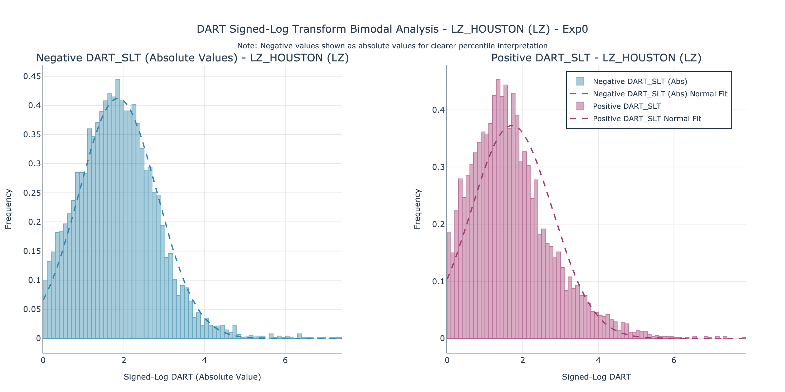

# ERCOT DART Price Prediction

- [Project Overview](#project-overview)
- [Dependent Variable](#dependent-variable)
- [Independent Variables and EDA](#independent-variables-and-eda)
- [Next Steps](#next-steps)

## Project Overview

ERCOT DART (Day-Ahead Real-Time) price prediction system for the Texas electricity market. This project analyzes and predicts the differences between day-ahead market (DAM) and real-time market (RTM) settlement prices in ERCOT, helping market participants understand price dynamics and make informed trading decisions.

All data in this README are from the ERCOT Loading Zone (Houston) for the period 1/1/2024 - 6/4/205.

**Key Features:**
- Historical ERCOT price data collection via official API (See: https://www.ercot.com/services/mdt/data-portal)
- Comprehensive exploratory data analysis of DART patterns
- Time series feature engineering for price prediction
- Machine learning models for DART forecasting
- Rich visualization suite for market analysis

## Dependent Variable

### Temporal Dynamics

The raw and transformed DART series show:
- Frequent, high-amplitude price excursions
- Short-lived spikes (typically 1–3 hours)
- The **Signed Log Transform (SLT)** retains directional information while compressing extreme values:

  `SLT(x) = sign(x) * log(1 + abs(x))`

This helps reveal structure while preserving magnitude asymmetry.

---

### Distributional Behavior

- The raw DART distribution is sharply peaked near zero with long tails.
- SLT symmetrizes and normalizes magnitude for clearer tail inspection and segmentation.

---

Separate histograms of positive and negative SLT values (shown as absolute):
- Reveal clear right-skew in both distributions
- Indicate heavy-tailed, non-Gaussian behavior
- Suggest different dynamics for positive vs negative deviations

---

### K-Means Cluster Analysis

To identify natural regime groupings:

Using K-means clustering on **positive and negative SLT magnitudes separately**:
- Optimal segmentation is **three clusters** on each side
- These correspond to mild, moderate, and severe pricing deviations

---

When clustering the **signed SLT values together**:
- Optimal **two-cluster solution** aligns with DART polarity (positive vs negative)
- Suggests sign alone captures the dominant regime division

---

### Moving Window Behavior

Using a 168-hour rolling window:
- Standard deviation, skewness, and kurtosis vary significantly over time
- Indicates changing volatility and shape
- Positive rate drifts seasonally, suggesting persistent market bias

---

### Cyclic and Frequency Structure

Power spectrum of the SLT series:
- Strong peak at **1 cycle/day**, confirming diurnal periodicity
- Additional harmonic content indicates layered temporal structure

---

Hourly sign probability by day of week and hour shows:
- Consistently **negative DARTs** during business hours
  - Counterintuitive?  Could make sense if DAM forecasts tend to be conservative?
- Higher **positive DART** probability overnight and early morning
- Weekends display flatter patterns

---

Hourly average DART by day of week and hour shows:
- Interpreted from the perspective of a **resource generator bidding into DAM**
  - **Positive DART (RT > DAM)** → **loss**: the generator misses potential upside by locking in a lower DAM price (red)
  - **Negative DART (RT < DAM)** → **gain**: the generator benefits from locking in a higher DAM price ahead of a lower real-time outcome (blue)
- Interpret very carefully, because we're looking at an aggregate view
  - Timespan of interest: **early weekday mornings**
  - **Gains** are more sporadic and tend to cluster overnight or late at night
  - Highlights the **risk asymmetry** and the value of selective hedging
  - These are first impressions only.  Do not trade based on this figure.

---

Spectral analysis of the DART sign sequence shows:
- Strong daily cycle
- Temporal structure in sign alternation, not just magnitude

---

### Sign Transition Behavior

Sign transition summary:
- ~80% persistence in sign from hour to hour
- Most runs last just 1–3 hours, but longer runs do occur
- Transitions often cluster at **1AM, 9AM, and 11PM**, possibly linked to load ramping or forecast updates

---

## Independent Variables and EDA

Summary:
- Select independent variables that conform with ERCOT operations
  - Do no "leak" the future into the modeling
  - To use lagged DART values, we must use actual last known (and not merely 24-hours prior)
- Define five categories of independent variables
  - DART lagged prices
  - DART historical rolling prices
  - Load forecast (from 6AM daily report np3-565-cd)
  - Solar power generation forecast (from 6AM daily report np4-745-cd)
  - Wind power generation forecast (from 6AM daily report np4-742-cd)
- Initial EDA
  - Summary time series plot
  - Distributional analysis (looking at whether (signed) log transformation is of benefit)
  - Cross-correlation analysis
- Additional Notes
  - Some of the EDA is on a per delivery hour basis (anticipating hourly modeling)
  - Some of the EDA considers data in the aggregate
  - How the data is organized here:
    - Each row of the data frame is an independent sample with a target and independent variables.
    - The target variable is DART SLT.  The independent variables as discussed and below. 

### Time Series
#### DART lagged prices

Per Delivery Hour plots of  DART SLT on Day T+1 vs DART SLT same hour on Day T-2.
- That is, although we label the lagged value as 24 hours, the actual value is 48 hours lagged.
- This assure no "leakage" of future into the forecast.
- Each point in each sub-plot represents one day.

#### DART rolling prices

Per Delivery Hour plots of DART SLT on Day T+1 vs DART SLT same hour rolling one week lag (with additional 24 hour offset as above)).
- Each point in each sub-plot represents one day.

#### Load forecast

Load forecast (log transformed MWh) by weather zone.

#### Solar power generation forecast

Solar power generation forecast (log transformed MWh) by geographic zone.  Zoomed in to show YTD 2025 System-wide value.

#### Wind power generation forecast

Wind power generation forecast (log transformed MHw) by geographic zone.

---

### Distributional Analysis
#### DART lagged prices
#### DART rolling prices
#### Load forecast
#### Solar forecast
#### Wind forecast

---

### Cross-correlation analysis
#### Summary
#### DART lagged and rolling prices
#### Load forecast
#### Solar forecast
#### Wind forecast

---

## Next Steps

These insights establish a strong foundation for downstream forecasting and classification models. They suggest:
- Rich temporal and categorical structure in DART behavior
- Availability of regime classification as a supplement to raw regression
- Opportunities for integrating time-aware and probability-based models
