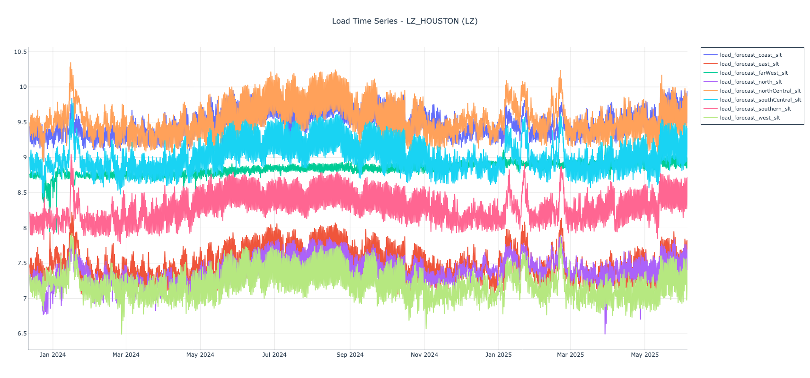

# ERCOT DART Price Prediction Workbench

- [Project Overview](#project-overview)
- [Project Objectives](#project-objectives)
- [Dependent Variable](#dependent-variable)
- [Independent Variables and EDA](#independent-variables-and-eda)
- [Modeling Experiments](#modeling-experiments)
- [Backtesting Experiments](#backtesting-experiments)
- [Reflections](#next-steps)

## Project Overview

ERCOT DART (Day-Ahead Real-Time) price prediction system for the Texas electricity market. This project analyzes and predicts the differences between day-ahead market (DAM) and real-time market (RTM) settlement prices in ERCOT, helping market participants understand price dynamics and make informed trading decisions.

All data in this README are from the ERCOT Loading Zone (Houston) for the period 1/1/2024 - 6/4/205.

**Key Features:**

- Historical ERCOT price data collection via official API (See: https://www.ercot.com/services/mdt/data-portal)
- Comprehensive exploratory data analysis of DART patterns
- Time series feature engineering for price prediction
- Machine learning models for DART forecasting
- Rich visualization suite for market analysis
- Flexible framework for modeling regression and classification
- Framework for evaluating various and sundry trading strategies

## Project Objectives

Objectives of this project are to:
- Attain knowledge of wholesale electricity markets through "learning by doing"
  - ERCOT appealed on the basis of superb educational resources and Public API
  - Apply good Data Science practices of data wrangling, ETL, modeling, and visualizations
- Create a workbench leveraging Factory Method object-oriented pattern to support multiple
  - ERCOT data products and their ETL
  - Modeling approaces (regression vs classification)
  - Modeling methods (linear regression, ridge, lasso, xgboost)
  - Back-testing of trading strategies (naive, signed_prob)
- Experience hands-on working with Cursor (mainly claude-4-sonnet)
  - Learn The Good, The Bad, and The Ugly of Coding Co-Pilots
    - Main Learning: The Pilot is accountable for every line of code
    - Subsidiary Learning: Beware of Pilot anthropomorphization and Co-Pilot sycophancy
- Set stage for production
  - Containerize (Docker)
  - Productization (SageMaker?  DataBricks?)
  - Agent Integration (LangChain, LangGraph)

The gory details on individual data and individual modeling experiments can be found in the /config directory.

## Dependent Variable

The dependent variable for this project is the Real-Time price vs Day-Ahead Market price for a given settlement point.  As noted, we've chosen to develop this workbench using the Houston LZ data.  As presented below, we settle as our dependent variable the signed log transform of the difference: real-time minus DAM price.

### Temporal Dynamics

The raw and transformed DART series show:
- Frequent, high-amplitude price excursions
- Short-lived spikes (typically 1–3 hours)
- The **Signed Log Transform (SLT)** retains directional information while compressing extreme values:

  `SLT(x) = sign(x) * log(1 + abs(x))`

This helps reveal structure while preserving magnitude asymmetry.

---

### Distributional Behavior

- The raw DART distribution is sharply peaked near zero with long tails.
- SLT symmetrizes and normalizes magnitude for clearer tail inspection and segmentation.

---

Separate histograms of positive and negative SLT values (shown as absolute):
- Reveal clear right-skew in both distributions
- Indicate heavy-tailed, non-Gaussian behavior
- Suggest different dynamics for positive vs negative deviations

---

### K-Means Cluster Analysis

To identify natural regime groupings:

Using K-means clustering on **positive and negative SLT magnitudes separately**:
- Optimal segmentation is **three clusters** on each side
- These correspond to mild, moderate, and severe pricing deviations

---

When clustering the **signed SLT values together**:
- Optimal **two-cluster solution** aligns with DART polarity (positive vs negative)
- Suggests sign alone captures the dominant regime division

---

### Moving Window Behavior

Using a 168-hour rolling window:
- Standard deviation, skewness, and kurtosis vary significantly over time
- Indicates changing volatility and shape
- Positive rate drifts seasonally, suggesting persistent market bias

---

### Cyclic and Frequency Structure

Power spectrum of the SLT series:
- Strong peak at **1 cycle/day**, confirming diurnal periodicity
- Additional harmonic content indicates layered temporal structure

---

Hourly sign probability by day of week and hour shows:
- Consistently **negative DARTs** during business hours
  - Counterintuitive?  Could make sense if DAM forecasts tend to be conservative?
- Higher **positive DART** probability overnight and early morning
- Weekends display flatter patterns

---

Hourly average DART by day of week and hour shows:
- Interpreted from the perspective of a **resource generator bidding into DAM**
  - **Positive DART (RT > DAM)** → **loss**: the generator misses potential upside by locking in a lower DAM price (red)
  - **Negative DART (RT < DAM)** → **gain**: the generator benefits from locking in a higher DAM price ahead of a lower real-time outcome (blue)
- Interpret very carefully, because we're looking at an aggregate view
  - Timespan of interest: **early weekday mornings**
  - **Gains** are more sporadic and tend to cluster overnight or late at night
  - Highlights the **risk asymmetry** and the value of selective hedging
  - These are first impressions only.  Do not trade based on this figure.

---

Spectral analysis of the DART sign sequence shows:
- Strong daily cycle
- Temporal structure in sign alternation, not just magnitude

---

### Sign Transition Behavior

Sign transition summary:
- ~80% persistence in sign from hour to hour
- Most runs last just 1–3 hours, but longer runs do occur
- Transitions often cluster at **1AM, 9AM, and 11PM**, possibly linked to load ramping or forecast updates

---

## Independent Variables and EDA

Summary:
- Select independent variables that conform with ERCOT operations
  - Do not "leak" the future into the modeling
  - To use lagged DART values, we must use actual last known (and not merely 24-hours prior)
- Define categories of independent variables
  - DART lagged prices
  - DART historical rolling prices
  - Load forecast (from 6AM daily report np3-565-cd)
  - Solar power generation forecast (from 6AM daily report np4-745-cd)
  - Wind power generation forecast (from 6AM daily report np4-742-cd)
- Initial EDA
  - Summary time series plot
  - Distributional analysis (looking at whether (signed) log transformation is of benefit)
  - Cross-correlation analysis
- Additional Notes
  - Some of the EDA is on a per delivery hour basis (anticipating hourly modeling)
  - Some of the EDA considers data in the aggregate
  - How the data is organized here:
    - Each row of the data frame is an independent sample with a target and independent variables.
    - The target variable is DART SLT.  The independent variables as discussed and below. 

### Time Series
#### DART lagged prices

Per Delivery Hour plots of  DART SLT on Day T+1 vs DART SLT same hour on Day T-2.
- That is, although we label the lagged value as 24 hours, the actual value is 48 hours lagged.
- This assure no "leakage" of future into the forecast.
- Each point in each sub-plot represents one day.

---

#### DART rolling prices

Per Delivery Hour plots of DART SLT on Day T+1 vs DART SLT same hour rolling one week lag (with additional 24 hour offset as above)).
- Each point in each sub-plot represents one day.

---

#### Load forecast

Load forecast (log transformed MWh) by weather zone.

---

#### Solar power generation forecast

Solar power generation forecast (log transformed MWh) by geographic zone.  Zoomed in to show YTD 2025 System-wide value.

---

#### Wind power generation forecast

Wind power generation forecast (log transformed MHw) by geographic zone.

---

### Distributional Analysis

#### Load forecast

Load forecast distribution analysis for the Coast Zone.
- The log transformation does not lead to more Gaussian distribution in this example.
- During modeling, especially with non-parametric methods, we may simply Z-score transform.
- Other transformations may be useful here, too, such as Box-Cox, etc.

---

Load forecast distribution analysis for the North Zone.
- The log transformation does lead to more Gaussian distribution in this example.
- To be clear, managing variance remains an objective, irrespective of Gaussian or other distribution.

---

#### Solar power generation forecast

Solar power generation forecast distribution analysis System-wide.
- Highly non-Gaussian even after log transformation.

---

#### Wind power generation forecast

Wind power generation forecast distribution analysis System-wide.
- Highly non-Gaussian even after log transformation.

---

### Cross-correlation analysis
#### Summary

Full cross-correlation matrix of dependent and independent variables.
- In this figure, not all variables are visible.
- For that we zoom on each category.

---

#### DART lagged and rolling prices

Closer look at cross-correlation matrix of DART SLT dependent and DART SLT independent variables.

---

#### Load forecast

Closer look at cross-correlation matrix of DART SLT target variable and load forecast variables.

---

#### Solar forecast

Closer look at cross-correlation matrix of DART SLT target variable and solar power generation forecast variables.

---

#### Wind forecast

Closer look at cross-correlation matrix of DART SLT target variable and wind power generation forecast variables.

---

## Modeling Experiments

- Executied three introductory experiments involving different combinations of data sets and modeling methods

### DART Price Data Only (Exp0)
- Explored the hypothesis that all the information that is needed for DART forecasting is already embedded in the DART price historical data.
- Estimated 24 delivery hour-specific models, visualized results in a dashboard, and recited the usual statistics, including MAE, RMSE, MAPE, sMAPE, rMAE, etc.  Much of the EDA above arose from this experiment.
- Did not dwell too long on this hypothesis.  The numerics and visuals (predicted vs actual) quite poor!

### DART Price Data and Forecast Data (Load, Solar Power Generation, Wind Power Generation) (Exp1)
- Explored the hypothesis that DART lagged price, DART rolling price, load forecast, wind power generation forecast, solar power generation, and positionally encoded time variables could improve results.
- Estimated 24 delivery hour-specific models, visualized results in a dashboard, and recited the usual statistics, including MAE, RMSE, MAPE, sMAPE, rMAE, etc.
- Compared linear, lasso, ridge, and xgboost regression.
- Presented results in a dashboard.  Below is an overview and zoomed version.
  - .png shown here, but there the interactive html dashboard are a great resource to probe the data.

- The figure above shows a sample dashboard when we train on 2024 and validate on 2025 (through June 4, 2025).

---

- The figure above shows a zoomed dashboard when we train on 2024 and validate on 2025 (through June 4, 2025).

- The quantitative metrics still signaled quite poor results.  Visual inspection, such as of the zoomed results, suggest that even with a plain vanilla xgboost model, the "direction" of the forecast seemed not entirely unreasonable.
- Hypothesis: a simple DART sign classifier can form the basis for a trading strategy.
  - One can do so much more here.  Set thresholds bimodally.  Use unsupervised methods (see above) to reflect natural DART clusters, and so on.
  - Here, we start simple.  MVP-style and then iterate.

## Backtesting Experiments

### DART Price Sign (Positive or Negative) Forecasting as a Trading Signal (Exp2 Data; Exp0 Model)
- The workbench was upgraded to do progressive validation.
  - Estimate 24 delivery-hour specific classification models with 2024 data.
  - For each week X of 2025 (through first week June)
    - Generate predictions for week X
    - Retrain with all 2024 and 2025 data through week X

- Two strategies were implemented:
  - Naive.  Just trade on the model prediction.
  - Sign-probability.  Set hour-specific confidence thresholds so that only top 5% (variable) of trades done.
  - Betting parameters: $10K initial capital; 5% bet size transaction cost; even-money payout; bet size $1.
    - MVP simplicity to start!

- Here are a couple of the dashboards (poorly captured as .png) to show the directions am heading.

- The figure above shows the confidence levels estimated for each delivery-hour.
  - Note: Known leakage as thresholds set from full set of progressive validation confidence values.

  ---

- The figure above shows the comparison of the naive vs sign probability trading results.

---

- Consider the figure above as a kind of attribution analysis time series per hour per week.

---

- Observation
  - Naive is a horrible idea.
  - Sign_probability is moving in the right direction.

- Conclusion
  - Have the workflow working "end-to-end"
  - See workflow/01-kag..., workflow/02-kag...,
  - Can now iterate on the dataset generation side and on the strategy backtesting side
  - Fun!

---

### References

- I found these references to be quite useful recent additions to the literature - even though I haven't (yet) progressed to neural networks just yet - I want to stay close to the data!!
  - Xu, J. and Baldick, R.  (2019).  Day-Ahead price forecasting in ERCOT market using neural network approaches.  https://doi.org/10.1145/3307772.3331024
  - Lago, et al. (2021).  Forecasting day-ahead electricity prices: A review of state-of-the-art algorithms, best practices and an open-access benchmark.  https://doi.org/10.1016/j.apenergy.2021.116983
  - Wang, et al. (2024). Deep Learning-Based Electricity Price Forecast for Virtual Bidding in Wholesale Electricity Markets.  https://doi.org/10.48550/arXiv.2412.00062
  - 

---

## Backtesting Experiments

- Availability of regime classification as a supplement to raw regression
- Opportunities for integrating time-aware and probability-based models

---

## Reflections

What I would do differently
- Not too much!
  - "Respect the data" means get hands on with it, ask a lot of questions, generate visualizations
  - "Hypothesis driven" means actively anticipate and test the results of each and every experiment and plot
  - You could argue why not jump directly to one of the major Data Science platforms for that?
    - With a Co-Pilot it is astounding how quickly one can generate and customize quite complex plots!
  - Many studies focus on the end-result - which nearly inevitably end with "hot" results.  Here, I wanted to share the step-by-step journey to include the false alarms amongst the hints of insight.
- Architect for future scaling.
  - ERCOT has 100s of settlement points.  I embedded handling multiple settlement points in the workbench itself.  So, lots of "outer loops".  A better idea may have been to perfect the workbench to operate on a single settlement point and use an external method to scale to the full range.

---

